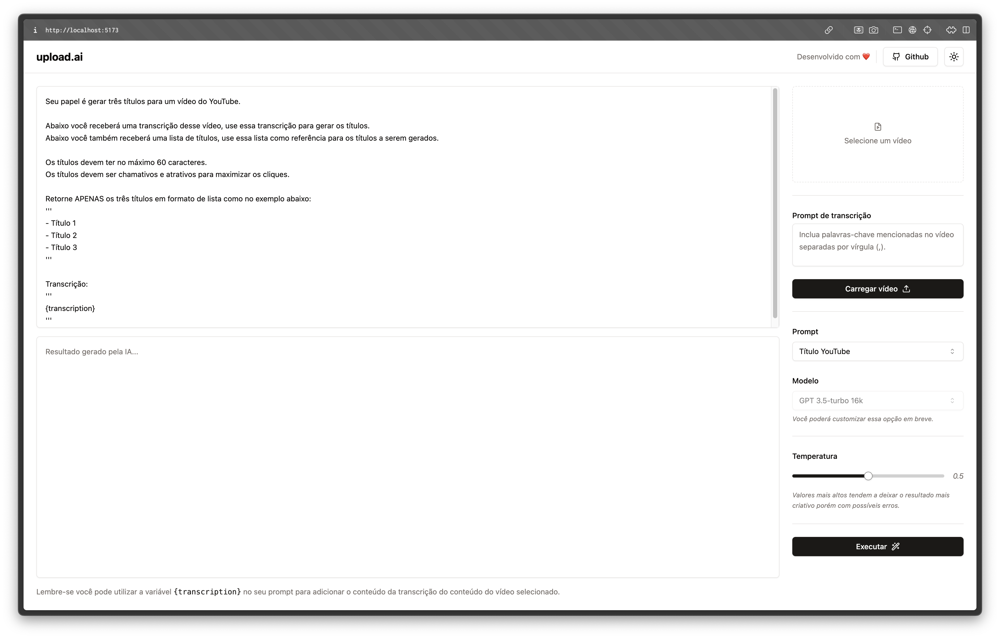

# upload.ai
Aplicação responsável por realizar a transcrição de um determinado vídeo utilizando IA e retornar os resultados de um prompt de comando através da api OpenAI.

## Bibliotecas e tecnologias utilizadas
- Typescript
- Prisma
- Zod
- Shadcn/UI
- TailwindCSS
- SQLite
- OpenAI API

## Documentação
- [Server](./server/readme.md)
- [Web](./web/readme.md)

----
Made with ❤️ by Julia Bresolin

